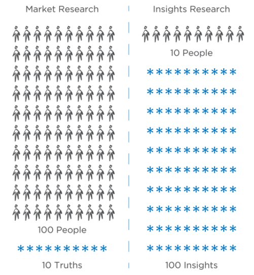
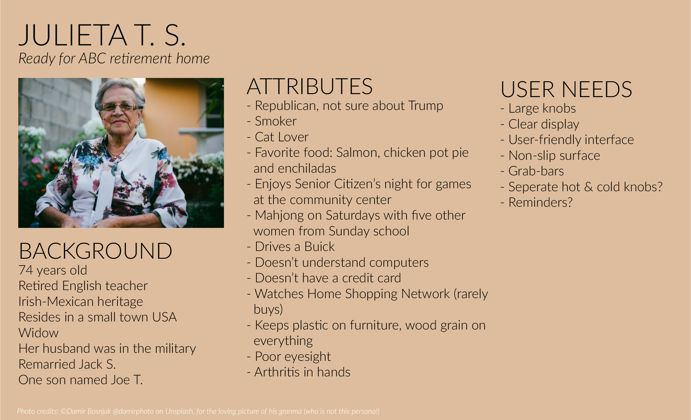
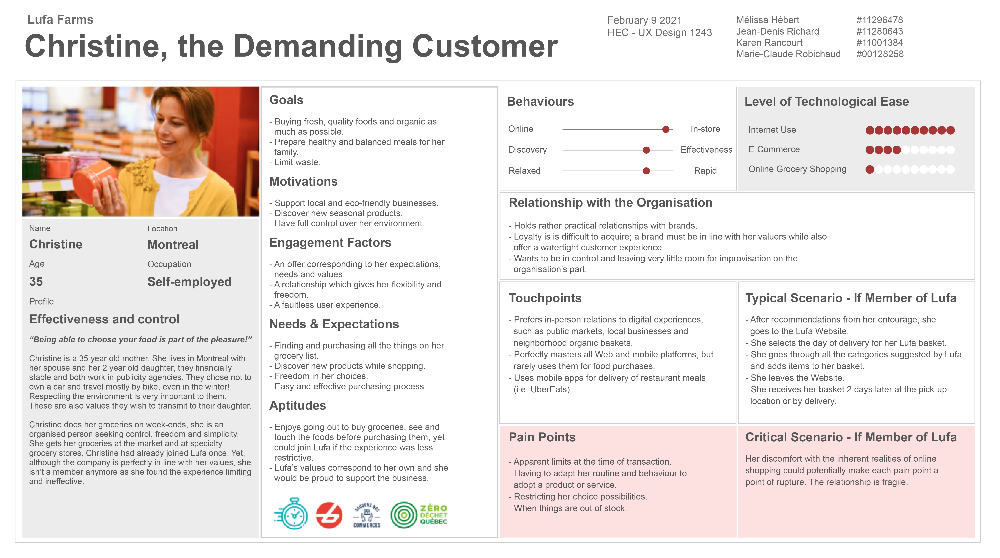
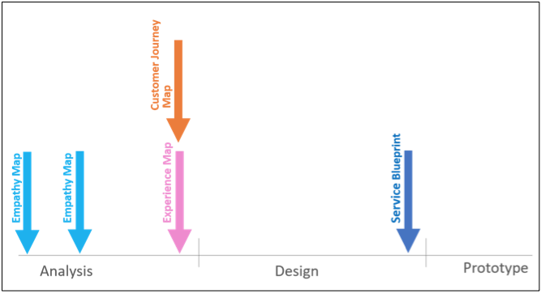
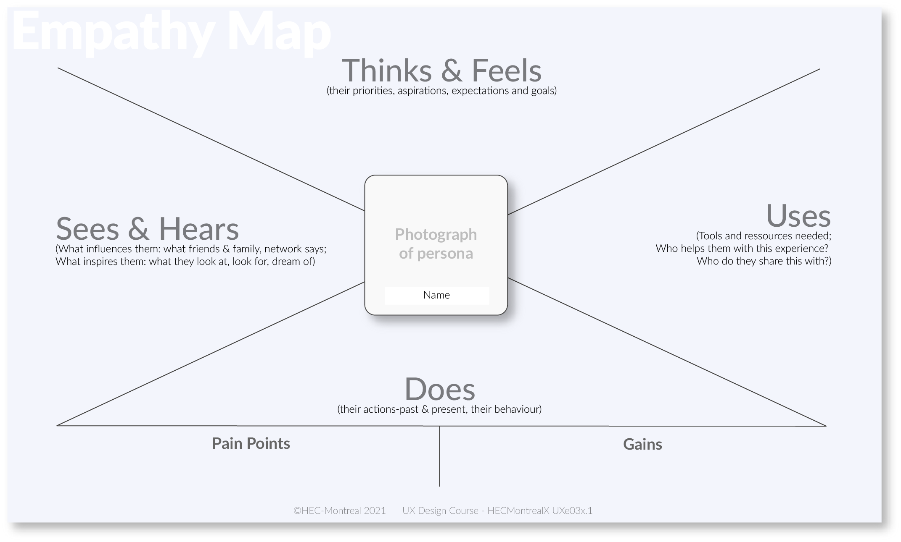
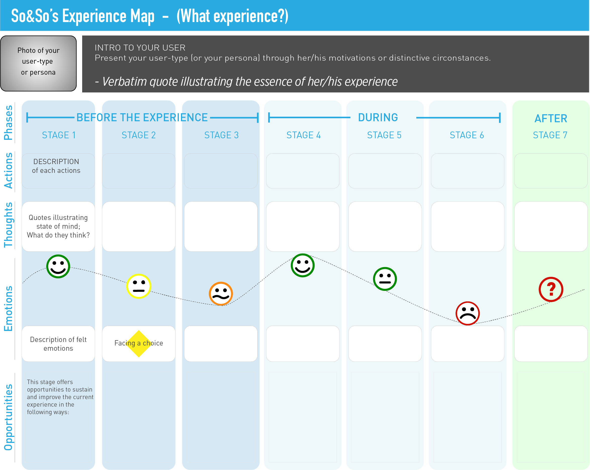
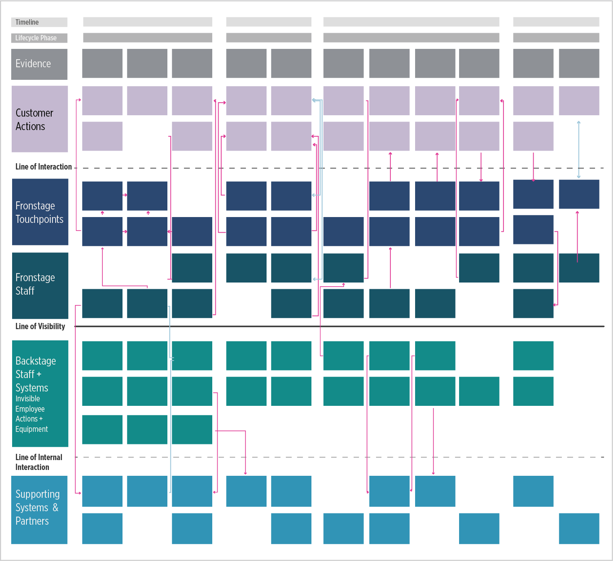

# Module Four

## From Research to Design

1. UX Research

> One is not better than the other, but for our purposes, qualitative research yields more useful insights that we can use as a basis for design than quantitative research's 'truths' do."

- To justify the redesign or the creation of a new digital product or system,
  an organization will previously have inquired about a number of things:
  for example: data on the current and potential revenue stream,
  Business Intelligence reports on specific market segments,
  and diagnosis reports of the current digital offering.

- Qualitative user research helps understand the motivations
  behind users’ decisions and their ways of doing things.

- Quantitative research does tell us
  what, when and how users do things,
  but it does not tell us why they do them.

- To lower the risk on a design investment,
  start with the users.

- You must identify
  how users see the issues that you are already aware of.

- Research does deliver a series of recommendations
  to the design team,
  but it also provides a better understanding
  of users’ points of view,
  mental models and motivations for a given experience.

1. Stakeholder Interviews

- These questions will help you better understand the aspects related to the business (viability), the technology (feasibility) and the "human-centeredness" (usability & desirability).

- Remember that the main question you are trying to answer is: "What is the experience we’re creating and what’s the enduring memory we’re hoping to create?".

<table class="colwidths-given docutils" style="width: 100%; border-spacing: 0px; margin-bottom: 24px; empty-cells: show; border: 1px solid #e1e4e5; color: #404040; font-family: Lato, proxima-nova, 'Helvetica Neue', Arial, sans-serif; background-color: #fcfcfc;" height="430" border="1"><colgroup style="box-sizing: border-box;"><col style="box-sizing: border-box;" width="30%"><col style="box-sizing: border-box;" width="70%"></colgroup>
<tbody style="box-sizing: border-box;" valign="top">
<tr class="row-odd" style="box-sizing: border-box;">
<td style="box-sizing: border-box; vertical-align: middle; line-height: 24px; margin-top: 0px; margin-bottom: 12px; font-size: 16px; padding: 8px 16px; background-color: #ffffff; border-bottom-color: #e1e4e5; border-left-width: 0px; border-left-color: #e1e4e5;">
<h3>Context</h3>
</td>
<td style="box-sizing: border-box; vertical-align: middle; line-height: 24px; margin-top: 0px; margin-bottom: 12px; font-size: 16px; padding: 8px 16px; background-color: #ffffff; border-bottom-color: #e1e4e5; border-left-color: #e1e4e5;">
<h3>Questions around the theme of <strong>Viability </strong></h3>
</td>
</tr>
<tr class="row-even" style="box-sizing: border-box;">
<td style="box-sizing: border-box; vertical-align: middle; line-height: 24px; margin-top: 0px; margin-bottom: 12px; font-size: 16px; padding: 8px 16px; background-color: #f3f6f6; border-bottom-width: 0px; border-bottom-color: #e1e4e5; border-left-width: 0px; border-left-color: #e1e4e5;">The Project</td>
<td style="box-sizing: border-box; vertical-align: middle; line-height: 24px; margin-top: 0px; margin-bottom: 12px; font-size: 16px; padding: 8px 16px; background-color: #f3f6f6; border-bottom-width: 0px; border-bottom-color: #e1e4e5; border-left-width: 0px; border-left-color: #e1e4e5;">

What are you making? Is the project financially viable?

</td>
</tr>
<tr class="row-odd" style="box-sizing: border-box;">
<td style="box-sizing: border-box; vertical-align: middle; line-height: 24px; margin-top: 0px; margin-bottom: 12px; font-size: 16px; padding: 8px 16px; background-color: transparent; border-bottom-color: #e1e4e5; border-left-width: 0px; border-left-color: #e1e4e5;">The Vision and Values</td>
<td style="box-sizing: border-box; vertical-align: middle; line-height: 24px; margin-top: 0px; margin-bottom: 12px; font-size: 16px; padding: 8px 16px; background-color: transparent; border-bottom-color: #e1e4e5; border-left-color: #e1e4e5;">How does this addition align with the product vision and the goals of the company?</td>
</tr>
<tr class="row-even" style="box-sizing: border-box;">
<td style="box-sizing: border-box; vertical-align: middle; line-height: 24px; margin-top: 0px; margin-bottom: 12px; font-size: 16px; padding: 8px 16px; background-color: #f3f6f6; border-bottom-width: 0px; border-bottom-color: #e1e4e5; border-left-width: 0px; border-left-color: #e1e4e5;"></td>
<td style="box-sizing: border-box; vertical-align: middle; line-height: 24px; margin-top: 0px; margin-bottom: 12px; font-size: 16px; padding: 8px 16px; background-color: #f3f6f6; border-bottom-width: 0px; border-bottom-color: #e1e4e5; border-left-color: #e1e4e5;">
<h3>Questions around the theme of&nbsp;<strong>Desirability &amp; Usability </strong></h3>
</td>
</tr>
<tr class="row-odd" style="box-sizing: border-box;">
<td style="box-sizing: border-box; vertical-align: middle; line-height: 24px; margin-top: 0px; margin-bottom: 12px; font-size: 16px; padding: 8px 16px; background-color: transparent; border-bottom-color: #e1e4e5; border-left-width: 0px; border-left-color: #e1e4e5;">The Offer</td>
<td style="box-sizing: border-box; vertical-align: middle; line-height: 24px; margin-top: 0px; margin-bottom: 12px; font-size: 16px; padding: 8px 16px; background-color: transparent; border-bottom-color: #e1e4e5; border-left-color: #e1e4e5;">What makes this offer desirable, and why?</td>
</tr>
<tr class="row-odd" style="box-sizing: border-box;">
<td style="box-sizing: border-box; vertical-align: middle; line-height: 24px; margin-top: 0px; margin-bottom: 12px; font-size: 16px; padding: 8px 16px; background-color: #f3f6f6; border-bottom-color: #e1e4e5; border-left-width: 0px; border-left-color: #e1e4e5;">The Audience</td>
<td style="box-sizing: border-box; vertical-align: middle; line-height: 24px; margin-top: 0px; margin-bottom: 12px; font-size: 16px; padding: 8px 16px; background-color: #f3f6f6; border-bottom-color: #e1e4e5; border-left-color: #e1e4e5;">For whom is it desirable? Why would they care? What impact will this feature have on consumer excitement or satisfaction with the product itself? Is it possible to validate the desire?</td>
</tr>
<tr class="row-odd" style="box-sizing: border-box;">
<td style="box-sizing: border-box; vertical-align: middle; line-height: 24px; margin-top: 0px; margin-bottom: 12px; font-size: 16px; padding: 8px 16px; background-color: transparent; border-bottom-color: #e1e4e5; border-left-width: 0px; border-left-color: #e1e4e5;">The Experience and the Memories </td>
<td style="box-sizing: border-box; vertical-align: middle; line-height: 24px; margin-top: 0px; margin-bottom: 12px; font-size: 16px; padding: 8px 16px; background-color: transparent; border-bottom-color: #e1e4e5; border-left-color: #e1e4e5;">What experience&nbsp;are we creating?&nbsp; What&nbsp;profound memory do we hope to create?</td>
</tr>
<tr class="row-odd" style="box-sizing: border-box;">
<td style="box-sizing: border-box; vertical-align: middle; line-height: 24px; margin-top: 0px; margin-bottom: 12px; font-size: 16px; padding: 8px 16px; background-color: #f3f6f6; border-bottom-color: #e1e4e5; border-left-width: 0px; border-left-color: #e1e4e5;"></td>
<td style="box-sizing: border-box; vertical-align: middle; line-height: 24px; margin-top: 0px; margin-bottom: 12px; font-size: 16px; padding: 8px 16px; background-color: #f3f6f6; border-bottom-color: #e1e4e5; border-left-color: #e1e4e5;">
<h3>Questions around the theme of <strong>Feasibility</strong></h3>
</td>
</tr>
<tr class="row-odd" style="box-sizing: border-box;">
<td style="box-sizing: border-box; vertical-align: middle; line-height: 24px; margin-top: 0px; margin-bottom: 12px; font-size: 16px; padding: 8px 16px; background-color: transparent; border-bottom-color: #e1e4e5; border-left-width: 0px; border-left-color: #e1e4e5;">Timing</td>
<td style="box-sizing: border-box; vertical-align: middle; line-height: 24px; margin-top: 0px; margin-bottom: 12px; font-size: 16px; padding: 8px 16px; background-color: transparent; border-bottom-color: #e1e4e5; border-left-color: #e1e4e5;">How much time do we have to design and create this product? Who else must be included in this cycle?</td>
</tr>
<tr class="row-odd" style="box-sizing: border-box;">
<td style="box-sizing: border-box; vertical-align: middle; line-height: 24px; margin-top: 0px; margin-bottom: 12px; font-size: 16px; padding: 8px 16px; background-color: #f3f6f6; border-bottom-color: #e1e4e5; border-left-width: 0px; border-left-color: #e1e4e5;">Impact on Others</td>
<td style="box-sizing: border-box; vertical-align: middle; line-height: 24px; margin-top: 0px; margin-bottom: 12px; font-size: 16px; padding: 8px 16px; background-color: #f3f6f6; border-bottom-color: #e1e4e5; border-left-color: #e1e4e5;">Who, within the organization, will be impacted by this new product design?</td>
</tr>
</tbody>
</table>

## Kick-off meeting

1. Structure

- There are three key milestones:
  the stakeholders’ interview, the kick-off meeting
  that set the tone towards a user-centered project
  and towards the third milestone: the vision workshop.

- The project officially starts at the kick-off meeting,
  where the whole team comes together and puts the last hand on the project brief
  and more specifically the UX design brief.

- The kick-off meeting has four main objectives:

  1. Define the project and its boundaries;
  2. Reveal underlying assumptions;
  3. Identify a realistic roadmap to the project;
  4. Build a consensus between all the parties involved in the Design Brief.

- remember one thing,
  the kick-off meeting is not the place to discuss potential solutions.
  It only concerns the path that the project must take, not the project’s destination.

- The kick-off meeting structure is pretty standard:

  1. Introductions
  2. Present the executive summary
  3. present and discuss scope and deliverables
  4. present the roles and responsibilities,
     again make expectations very clear.
  5. state timelines, communication and meeting plans;

- The last part of the kick-off meeting is a discussion about
  who we are building this solution for. This is the UX bit.

- In this last segment of the kick-off,
  the three main aspects of human-centered design
  will likely come to the forefront of the discussion:
  viability, feasibility and desirability of the project.

2. UX Design Brief

- It is a concise, written description
  of one to three pages, which summarizes the overall project plan to ensure
  that everyone agrees on what is being asked.

- should encourage the design team to ask the right questions
  before looking for the right solutions,
  and more importantly, without giving them the answer.

- An effective UX Design Brief will prevent lots of pain:
  miscommunications, unnecessary back-and-forth, pointless emails,
  calls or additional meetings to clarify details about the project.

- The brief will have all the project management parameters
  that have been discussed at the kick-off.

- The Problem Statement is a clear and simple definition of the problem,
  with no answer attached to it.

- In order to be worded in a way that’s inspirational for the design team,
  UX practice prefers formulating it as a “How might we...?” type of question.

## Personas

- A persona is essentially a proxy user, based on use-profile.

- It comes out of what was collected about users through observations,
  interviews, secondary data, like analytics, industry reports and such.

- Basically, a persona acts as a stand-in for real users
  between encounters with actual, real-life end-users.

- What technologies do we need to implement
  to deliver to meet the needs of these personas?

- We need to understand their emotional drivers or, more specifically,
  we need to understand why and what motivates them to spring to action.

- What specifically do they enjoy, what irritates them,
  and what are the particulars of their relationship to your product or service.

- Issues are opportunities in disguise.

## UX Maps

1. Empathy Map

- it can be used to create user profiles, but it is used mostly to structure the data collection and analysis, but it seldom finds its way into client deliverables

- use it to retrieve information about the users that will in turn build empathy towards them and force alignment and understanding about a user type – or persona.

- The empathy map starts being used at the time of the user research before the design process. It is first used as an interview guide to help us organize questions.

- It is built in four quadrants: Thinks&Feels, Does, Sees&Hears and Uses.

2. Experience Maps

- A narrative tool used to visualize the entire end-to-end experience that a persona goes through to reach a goal. We use it to understand and address the users’ needs and pain points.

- The experience map is developed at the end of the analysis phase before starting the design process.

- The experience map is a client deliverable. It is also used as a reference point amongst a team throughout the design cycle.

- Start by gathering a series of user’s objectives and actions into a timeline structure. Then, we elaborate the structure by adding the user's thoughts and emotions to create a narrative. Finally, we condense the narrative into a visualization that we will use to communicate insights to inform the design process.

3. Customer Journey Map

- A customer journey map is the sum a single persona’s experiences told in one story.

- The customer journey map is developed at the end of the analysis phase before starting the design process.

- The customer journey map is built chronologically and includes, vertically, all the steps of the experience as lived by the user.
  The horizontal structure of the map is divided into five (5) categories: doing, thinking, feeling, customer experience and opportunities. It can also present technological devices and highlight processes (in the action field).

- Just like in the case of the experience map, we start by gathering a series of user’s objectives and actions into a timeline structure. Then, we elaborate the structure by adding the user's thoughts and emotions to create a narrative. Finally, we condense the narrative into a visualization that we will use to communicate insights to inform the design process.

4. User Scenarios

- The customer journey map and experience map represent and highlight a user's experience with its high and low points, according to what we refer to as their typical scenario.

- However, some scenarios – which we refer to as critical and tragic scenarios - are usually not mapped out because of their specific context. In these cases, we keep them as “written rendition” embedded in the persona sheet

- The critical scenario represents what would possibly make your user disengage with your product, service, or system.

- The tragic scenario refers to the potentially lethal consequences for your service or product. Its objective is to test the limits of a system to make sure it can support any condition.

5. Service Blueprint

- The service blueprint can be used as an overview at any point in the project, but it is often used at the end of the design phase as a predictive plan, describing the service to come. The service blueprint shows all levels of the service at a glance, from user actions, interfaces, supporting processes to servers and other internal systems.

- This map is organized into two general interaction spaces: Frontstage (where the interactions happen) and backstage

- In frontstage will be all that is visible to users: employees & human processes and interfaces with which users interact;

- Behind the visibility line, the backstage holds all employees, software and the physical and digital infrastructure that underpin the service.

- The service blueprint diagrams the relationships between what your customers go through when interacting with your service and different components within your organization supporting this service. We use the service blueprint to understand how an organization contributes to the customer journey.

- The service blueprint is developed at the end of the design phase before starting the prototype process.

