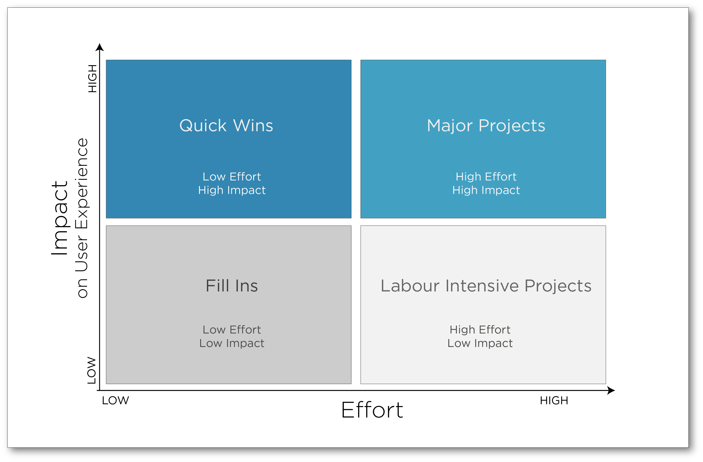

# Module Five

## Design Thinking

1. What is "Design Thinking"

- Design Thinking is particularly relevant when there is an innovation challenge.
  Any kind of innovation, from corrective incremental changes to radical or disruptive creative leaps.

- In engineering circles, it is considered a problem-solving method.
  In the design practice, David Kelley and Tim Brown from IDEO
  who coined the term define it as an approach.

- If that challenge has not been encountered before,
  which falls into the WICKED PROBLEM category.

- Wicked problems are a class of complex and unique problems that have no obvious solution and for which every attempt to create a solution displaces the problem.

- They resist traditional and linear solutions because the problem definition evolves
  as new possible solutions are considered and/or implemented.

- Design Thinking involves user at every step of the project,
  assuring we don’t lose sight of them.
  An empathic perspective of the user’s experience is crucial.

- Design Thinking draws from the designer’s toolkit,
  as opposed to just brainstorming once and moving on.

- Designers don’t deliver innovation because they have some “obscure creative talent”,
  yes they usually are talented, trained and experienced
  but they also have developed methods and tools to do so.

- It focuses on integrating the needs of people,
  the possibilities of technology and the requirements for business success.

- Design Thinking, like all design activities,
  works within the constraints of its client’s situation:
  Its technological system, its business goals and vision, its workforce.

2. IDEO's rules

- Promote crazy and out of the box ideas.

- Differ judgement. There are no bad ideas. You never know where a good idea is going to come from. Make sure everyone feels comfortable to voice their ideas.

- One conversation at a time. This way, the group stays focused on the same topic and develops it together.

- Lean on each other’s ideas: build on each other’s train of thought. Ideas belong to the whole group.

- Stay focused on the topic. Try to keep the discussion on target. Otherwise, you can diverge beyond the scope of what you're trying to design for.

- Be visual: sketch, draw, use scenarios, or anything you seem fit as props to articulate your ideas more clearly. It is the fastest way to get ideas out. No matter your drawing skills.

- Aim for quantity, not for perfection. The best ideas always come out of a large output of crazy ideas.

- Leave hierarchy at the door. We are all equal in the ideation space!

## Divergent and Convergent Cycle

1. Overview

- Divergent thinking produces a multitude of alternate solutions.

- Convergent thinking seeks a single best solution.

- This cycle is like a muscle that stretches and compresses:
  stretching your imagination and then bringing it back in, crafting
  the new concept into an actionable solution.

- When diverging, the goal is to generate a great many alternative
  solutions. All ideas, even the craziest, are considered; this highlights the
  importance of divergence in the innovation process.

## Divergent Thinking

1. Power of Ten Technique

- This technique is a reframing method. We change one parameter of the project to consider the latter in a whole different lens.

- For example, what if we assume that the clients/end users are absolutely delighted by your offer and would be willing to pay 1 million $? What experience would be worth that much to them? Another example: What if the organization had a 10-year long relationship with this user; what would the user expect?

- Primary goal: To expand ideas' space to a much wider perspective

2. Futures Thinking

- "Strategic Foresight", "Futurism", "Futurology", "Anticipation Studies", and "Futures Thinking" (sometimes "Futures" for short) are terms that are often used interchangeably.

- Futures Thinking is a structured way to consider the long-term perspective around an experience along with the methods and approaches used to do so.

- Probable, plausible, possible, preferred and provocative scenarios – all informing present-day strategies.

- The main difference between Design Thinking and Futures Thinking is that Design Thinking goes through a process of divergent and convergent thinking to deliver its potential solutions. In contrast, Futures Thinking identifies a variety of axes of possible scenarios (no convergent scenario).

## Convergent Thinking

1. Prioritize

- Once we have given the crazier ideas a second reading, we are ready to prioritise all ideas. Prioritisation is a convergent activity.

2. 2x2 Matrices

- Placing our ideas on a 2x2 matrix is the simplest way to assign a value to each idea in order of priority.

- Criteria often used:

  - Impact on user experience
  - Effort (time, cost and, or resources)
  - Feasibility
  - Viability
  - Familiarity - Innovation
  - Potential risks
  - Benefits to the organization

- Two frequently encountered matrices are (a) effort vs impact on user experience and (b) feasibility vs familiarity-innovation.

- Effort (x-axis): This variable defines the degree of effort to be deployed to implement a new idea; that is, the necessary budget, time, and human resources necessary for its development.

- Impact (y-axis): For this variable, it measures the impact that the new idea will have on your users' experience.

- Quick wins: In this quadrant, you will find activities with the best return on investment. These ideas will bring significant value to your project.

- Major projects: As its name says, in this quadrant will be found the large-scale projects that require a lot of effort but will have a big impact on the user experience and, by extension, on the organization. It will be necessary to carefully choose the concepts to be implemented according to their value versus their complexity to ensure various objectives (KPIs). Be efficient.

- Fill-ins: Here will be ideas requiring little effort to set up but will have a low impact on your user's experience. These can be added at any time ... as a filling between projects or during a waiting period.

- Labour intensive: One can wonder if these concepts are worth the trouble. However, take time to make sure there is nothing in this category that would enable more desirable features. These might prove useful.

## UX Report

1. Simplified

- Content
- Executive Summary
- Objectives and/or research questions
- Methodology
- Results
- Opportunities for improvement and recommendations
