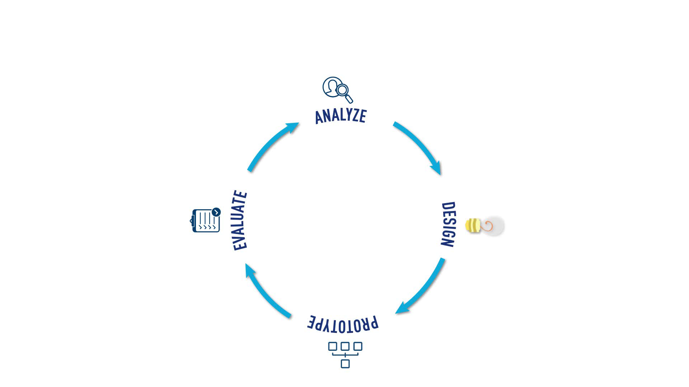

# Module Three

## UX Design

> "UI is the saddle, the stirrups and the reins. UX is the feeling you get when riding the horse."

1. Hierachy of User Needs

- In order to develop great digital products, services or systems, first, we have to be clear on what high-level needs we aim at supporting; we have to design the experience.

  

2. Innovation

- UX Design delivers user-centred innovation, meaning that innovation depends on how humans use technology instead of conceiving innovative technology.

- UX Design is all about innovation; in the same way, UI design is all about interfaces.

- Why innovate? To solve problems, increase productivity, get a stronger brand image, and ultimately outpace the competition.

- If you want to change the end result, you have to change the way you do things.

- Three types of innovations: incremental, radical and disruptive.

- Incremental innovation is a series of small improvements
  made to a product, service, process, or method.

- Radical innovation is a major technological breakthrough that
  transforms the industry, using existing technology and
  introducing a variation that is entirely new.

- Disruptive innovation has strategy to be able to get into an extremely complex market filled with large players; Only way to be part of the game is to create a new market to eventually disrupt an existing market;

3. UX Design Cycle

> “Everyone designs who devises courses of action aimed at changing existing situations
> into preferred ones.”

- UX Design aims to conceive strategic solutions to meet users'
  needs and perspectives and to define the overall experience we want for them.

4. Mental Models, Insights, Empathy

- A mental model is an internal representation of an external reality.

- When we design new products or services, we need to consider how
  they may satisfy, affect, change, or fit the users’ world.

- If you abruptly disturb users’ mental model, and they don’t
  understand why, they’ll most likely reject your offering.

- Insights are really the golden
  nuggets in the design process.

- In the context of UX, an insight is a deep understanding of
  something; a behaviour, a person, a situation.

- Insights emerge from the analysis of what has been heard or observed.

- Empathy is feeling someone else's emotion.

- In UX, we use empathy as a creative lever that keeps us centred on our users
  as represented by the real people that we have met through
  the analysis phase.
